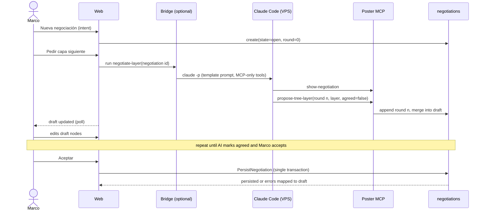
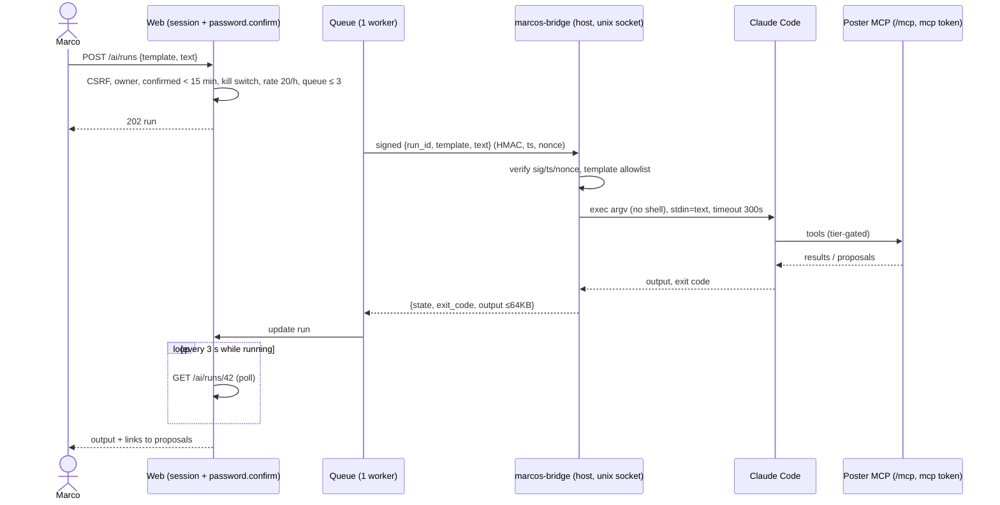

## Context

See `proposal.md` (Why, What Changes) and the delta specs for the behavior contract. Current state that
shapes the approach (from the graphify report and source):

- `Project` (114 edges) and `Issue` (60 edges) are the god nodes of the domain; `ResourceLinker` (122 edges)
  builds absolute URLs for every MCP tool response; `ReplaysFormRequest` (59 edges) makes MCP tools reuse the
  web Form Requests so validation is identical on both surfaces. Both support classes are reused.
- 38 MCP tools under `app/Mcp/Tools/{BoardColumns,Comments,Habits,Issues,Labels,Projects,Sprints,Views}`,
  one server `PosterServer`.
- API v1 (`routes/api.php`): login, qr-login, user, logout, projects, issues, board-columns, sprints,
  labels, habits today/increment/decrement. `ApiContractTest` enforces route ↔ `openapi/v1.json` set
  equality; `ResolvesProjectByKey` gives owner-scoped, non-disclosing 404s.
- Habits (`Habit`, `HabitDay`, `HabitEntry`) are the healthiest domain: UTC-6 anchoring via
  `Config::string('habits.timezone')`, sticky completion via `peak_amount`, row-locked increments. The
  `habits` table has `user_id` but no project link.
- PostgreSQL in production (Coolify on the VPS, auto-deploy of `main`). Claude Code runs on the VPS host
  as user `ubuntu`, outside the application container.
- Constraint D-017: no implementation before 2026-10-11.

## Goals / Non-Goals

**Goals:**
- One domain action layer used identically by web controllers, MCP tools, API endpoints, proposal
  acceptance and tree-negotiation persistence, so tiers, validation and audit are enforced once.
- Derived state (item locked/available, plan done, streak state, identity votes) computed in one place and
  never stored where it can drift, except where a cache is needed for query cost (explicitly marked).
- Every phase in `tasks.md` leaves `main` deployable.

**Non-Goals:**
- Re-deciding the visual language: it is fixed by the approved visual system (see D16).
- posterMobile code (`marcos-os-mobile`). Only the server contract it will consume is designed here.
- Multi-user, sharing, notifications, email, push.
- Re-importing legacy data into the new schema.

## Decisions

### D1. Replace, don't rename, the legacy tables (clean-slate baseline)

Because R21 requires a clean database, the new schema is created by fresh migrations
(`objectives`, `plans`, `items`, `item_dependencies`, …) and the legacy tables (`projects`,
`project_members`, `sprints`, `board_columns`, `labels`, `issues`, `comments`, `issue_label`) are dropped by
a single migration that only runs after the guarded reset. Habit tables are kept and extended (they are
reused per R20), but emptied by the reset.
*Alternative considered*: renaming `projects`→`objectives` and `issues`→`items` in place with data
transforms. Rejected: R21 wants a clean start, and in-place transforms would carry sprint/column
semantics into the new model.

### D2. Data model

| Table | Key columns | Notes |
|---|---|---|
| `objectives` | `id, user_id, key (unique), title, identity_statement?, state (draft/active/closed/retired), position, next_item_number, closed_at?` | 5-point plan in `control_plans` |
| `plans` | `id, objective_id, title, state (draft/active/done/retired), level?, position` | |
| `control_plans` | `id, plannable_type/id (objective/plan), outcome, deadline (date), metric_name, metric_target, metric_current?, risks (json list), contingency` | one per objective/plan |
| `control_map_entries` | `id, plannable_type/id, zone (mine/influence/outside), text, position` | |
| `items` | `id, objective_id, plan_id, number, kind (task/milestone), title, description?, two_minute_version, target_date?, is_active (bool), completed_at?, retired_at?, position` | `unique(objective_id, number)`; partial unique index `is_active = true` per user enforces one Now task |
| `item_two_minute_history` | `id, item_id, text, source (owner/ai), replaced_at` | "I'm stuck" history |
| `item_dependencies` | `id, prerequisite_id, dependent_id` | `unique(prerequisite_id, dependent_id)`, check `prerequisite_id <> dependent_id` |
| `milestone_evidence` | `id, item_id, text, link?, image_path?` | |
| `focus_sessions` | `id, item_id, started_at, ended_at?, end_reason?` | focus clock survives reloads |
| `habits` (+cols) | `objective_id?, plan_id?, two_minute_version, identity_statement?, level?, level_ladder (json)?, retired_at?` | `archived_at` renamed to `retired_at` semantics |
| `habit_days` (+col) | `two_minute_logged (bool)` | shown-up = completed OR two_minute_logged |
| `retirements` | `id, retirable_type/id, reason, decision (move/split/archive_as_is), decision_payload (json), prior_state, retired_at, restored_at?` | history kept on restore |
| `captures` | `id, user_id, text, source, triaged_at?, result_type/id?` | |
| `weekly_priorities` | `id, user_id, iso_week, main_type/id, maintenance (json, max 2)` | |
| `reviews` | `id, user_id, kind (weekly/objective), subject_id?, answers (json), created_at` | summit evidence lives in `milestone_evidence` |
| `ai_proposals` | `id, source, operation, payload (json), summary, rationale, target_fingerprint, state (pending/accepted/rejected/expired/stale), decided_at?` | |
| `ai_permission_grants` | `id, scope_objective_id?, expires_at, revoked_at?` | at most one active |
| `ai_audit_entries` | `id, source, tier, operation, target_type/id, before (json), after (json), proposal_id?, grant_id?, bridge_run_id?` | |
| `negotiations` | `id, intent, state (open/agreed/accepted/abandoned/persisted), draft (json), round` | |
| `negotiation_rounds` | `id, negotiation_id, round, ai_proposal (json), owner_edits (json), ai_agreed (bool)` | |
| `ai_bridge_runs` | `id, template, input_text, state, exit_code?, output (≤64 KB), queued_at, started_at?, finished_at?` | |

Item `state` is **derived**, not stored: `retired` if `retired_at`; `done` if `completed_at`; `active` if
`is_active`; `locked` if any non-retired prerequisite lacks `completed_at`; else `available`. A query scope
computes it with one `NOT EXISTS` subquery so list endpoints stay O(1) in queries.
*Alternative*: a stored `state` column updated on every check. Rejected: cascades (uncheck, retire, restore,
dependency edits) are exactly where stored state drifts.

### D3. One domain action layer (`app/Actions/*`)

Every mutation is an invokable action class (`CheckItem`, `RetireElement`, `AddDependency`,
`PersistNegotiation`, …) taking an `Actor` value object (`owner-web`, `owner-api`, `ai-mcp`, `ai-bridge`).
Controllers, MCP tools (still through `ReplaysFormRequest` for validation parity), API controllers and
`AcceptProposal` all call the same action. A `TierGate` inside the action layer classifies the operation
(see `ai-operations`) and, for AI actors, applies directly (minor), stores a proposal (major without grant)
or applies with a grant; it writes the audit entry in the same DB transaction.
*Alternative*: enforcing tiers in each MCP tool. Rejected: the bridge and proposals would need to repeat it,
and `mcp-server` requires web parity.

### D4. Dependency cycle check

On `AddDependency`, a recursive CTE walks from the proposed dependent's descendants; if it reaches the
prerequisite, reject and return the path. Graph size is personal-scale (hundreds of nodes), so no caching.
The DB uniqueness and self-edge check constraints back the application rule.

### D5. Tolerant streak algorithm

Build the ordered list of past **opportunities** per recurrence (days, scheduled weekdays, or closed ISO
weeks, all UTC-6), map each to shown-up / missed, exclude a pending today (or in-progress week). Walk
backwards: a run continues through a single missed opportunity (which does not add to the count) and ends
at the first pair of consecutive misses. `streak_state` = `restart` if the most recent two opportunities
are missed, `at_risk` if exactly the most recent one is missed, else `ok`. Best streak is the max run under
the same rule. The existing `peak_amount` sticky-completion rule is unchanged; the new
`two_minute_logged` flag only affects shown-up, never `completed`.

### D6. Now selection

`active` item if any, else the first available item (by plan position, item position) of the current
weekly main priority, else the oldest available item of the first active objective by position. The
`is_active` partial unique index guarantees "exactly one" at the database level; `StartItem` clears the
previous one in the same transaction and closes its open `focus_session`.

### D7. Silent 25-minute cue (client-side, server clock)

The Now page receives `focus_started_at` (server) and computes the next cue locally; no polling, no Web
Notifications API, no audio element. The cue is a discreet inline region inside the Now card (3px line
that fills over the tramo + small dot + inline text, per `visual/screens/02-now.html`) with
`aria-live="off"` and no `role="status"`: it is deliberately NOT announced to screen readers. Its three
options are real, labeled buttons in normal tab order (focus never moves to them automatically):
"Sigo" dismisses the cue until the next 25-minute tramo; "Terminé" calls the same action as "Marcar
hecho"; "Estoy trabado" opens the same flow as the stuck button. It auto-dismisses after 60 s. The
interval is `config('marcos.focus_cue_minutes', 25)`.

### D8. Retirement as one transaction

`RetireElement` validates reason and decision, applies the decision (move children / create split
replacements inheriting edges / cascade retire with the same reason), records a `retirements` row per
retired element with `prior_state`, recomputes affected dependents, all inside one transaction. Hidden-ness
is a global Eloquent scope `NotRetired` on objectives, plans, items, habits and captures, bypassed only by
the Retired view and restore actions.

```mermaid
sequenceDiagram
    actor Marco
    participant Web as Web (Inertia)
    participant A as RetireElement
    participant DB as PostgreSQL
    Marco->>Web: Retirar plan P (reason, decision=move → plan Q)
    Web->>A: __invoke(Actor owner-web, P, reason, move Q)
    A->>DB: BEGIN
    A->>DB: validate Q same objective, not retired
    A->>DB: UPDATE items SET plan_id=Q WHERE plan_id=P AND retired_at IS NULL
    A->>DB: UPDATE plans SET state=retired (P); INSERT retirements
    A->>DB: recompute dependents (derived, no writes) / audit
    A->>DB: COMMIT
    A-->>Web: RetirementResult (moved 3 items)
    Web-->>Marco: Tree without P; items under Q
```

### D9. Tree negotiation flow

Drafts live in `negotiations.draft` (JSON mirroring the domain tree). The AI writes rounds via the MCP tool
`propose-tree-layer` (route a: Marco runs Claude Code on the VPS) or via a bridge run with template
`negotiate-layer` (route b). Persistence calls domain actions inside one transaction; any validation
error rolls back and is mapped onto draft node paths.



### D10. Web → VPS CLI bridge architecture

Components: (1) `ai_bridge_runs` + a queued job `DispatchBridgeRun` on a dedicated queue with
`maxProcesses=1`; (2) a small host-side service `marcos-bridge` (systemd unit, user `ubuntu`) listening on a
Unix socket bind-mounted into the app container (`/run/marcos-bridge/bridge.sock`); (3) the Claude Code CLI
invoked by the service with a template-specific prompt, `--allowedTools` restricted to the template's
Poster MCP tools, an MCP config holding a dedicated `mcp` token, no Bash/Edit/Write tools, a working
directory with no repositories, and `timeout 300`.

Security properties: the request carries only `{run_id, template, text}`; the service maps `template` to a
fixed argv array (no shell), passes `text` via stdin; HMAC-SHA256 over body+timestamp+nonce with a secret
shared via Coolify env and a root-owned file on the host; nonce cache on the host; the socket is not a
network listener. The CLI gains no privilege beyond MCP, and MCP enforces `ai-operations` tiers — so the
worst case of a prompt injection is a proposal or an audited minor change. Kill switch:
`AI_BRIDGE_ENABLED` env (app) plus `systemctl stop marcos-bridge` (host).



*Alternatives considered*: SSH forced-command from the container to the host (simpler transport, but puts a
private key in the container and uses the public sshd); mounting the Docker socket (root-equivalent,
rejected); running the CLI inside the app container (would give the web process an AI with filesystem
access to the app, rejected).

### D11. AI tiers enforcement over MCP

MCP tools are grouped by tier; `propose-change` always creates a proposal; `apply-change` requires a grant
covering the target; minor tools apply directly. The `target_fingerprint` (hash of the target's
`updated_at` and relevant fields) makes stale proposals fail safely on accept.

### D12. API v1 and MCP cutover strategy

Hard cutover at Phase 2 (routes unregistered, tools removed), matching the clean DB: there is no legacy
data to serve anyway. Habits endpoints keep paths and the 12 legacy fields (additive shape) so the current
posterMobile build keeps its most-used daily feature. `openapi/v1.json` `info.version` is bumped to
`2.0.0` while the path prefix stays `/api/v1` (avoids a second auth surface; see Open Questions).

| Consumer | Before | After Phase 2 | After Phase 11 |
|---|---|---|---|
| posterMobile projects/issues/board/sprints/labels | works | **404** | replaced by objectives/items/daily in `marcos-os-mobile` |
| posterMobile habits | works | works (extra fields ignored) | + 2-minute endpoint, `Idempotency-Key` on taps |
| posterMobile login / QR / logout | works | works | works |
| Claude MCP project/issue/board/sprint/label/comment/calendar tools | works | **removed** | — |
| Claude MCP habit tools | works | works (retire replaces archive in Phase 6) | works |
| Skill `foco-hoy` (reads issues via MCP) | works | **breaks** → switch to `now-view` (Phase 3) | works |

### D12b. Mobile write contract (requests from `marcos-os-mobile`)

- `GET /api/v1/now` adds `is_active` and `focus_started_at` (from the open `focus_sessions` row) so mobile
  can tell continue from start and compute the 25-minute cue locally.
- `POST .../items/{item}/start` calls the same `StartItem` action as the web (D6) and answers the `/now`
  shape; `POST .../items/{item}/two-minute` calls the same action as the web "estoy trabado" fallback
  (history kept in `item_two_minute_history`).
- Idempotency: a table `idempotency_keys (user_id, route_name, key, request_hash, status, response_code,
  response_body, locked_until, created_at)` with `unique(user_id, route_name, key)`, handled by an
  `Idempotent` middleware on mobile write routes. First request inserts the row (in-flight → `409` for
  concurrent duplicates), stores `2xx`/`422` responses, deletes the row on `5xx`. Same key + different
  `request_hash` → `422`. Window **24 h**; a scheduled `model:prune` removes older rows. Habit replays
  return the stored response, so the day of the first request wins.
- Uncheck stays web-only (not exposed on API v1), by agreement with `marcos-os-mobile`.
*Alternative*: client-generated ids on every write (natural idempotency). Rejected: increment/decrement
have no natural id, and a header works uniformly across all mobile writes.

### D13. Legacy export and reset

`marcos:export-legacy` (pg_dump custom format + per-table JSON + manifest with counts/checksums, secrets
stripped from JSON) → `marcos:rehearse-restore` (restores into a scratch database, compares counts) →
tag `pre-marcos-os` → deploy Phase 2 → `marcos:reset --confirm` (guarded) → run the Phase 2 drop/create
migrations. Tokens and the owner user are preserved (the reset truncates only domain tables).

```mermaid
sequenceDiagram
    actor Marco
    participant VPS
    participant App as App container
    participant PG as PostgreSQL
    Marco->>App: php artisan marcos:export-legacy --out=/backups/<ts>
    App->>PG: pg_dump -Fc + SELECT per table
    App-->>VPS: dump + JSON + manifest (counts, sha256)
    Marco->>App: php artisan marcos:rehearse-restore <ts>
    App->>PG: CREATE DATABASE scratch; pg_restore; compare counts; DROP scratch
    Marco->>VPS: copy backup locally (scp)
    Marco->>App: git tag pre-marcos-os; merge Phase 2 (Coolify deploys)
    Marco->>App: php artisan marcos:reset --confirm
    App->>PG: guard checks → migrate (drop legacy, create new) → keep users + tokens
```

### D14. UX behavior (non-visual)

Visual design: see D16 (approved visual system inside this change). Behavior rules every screen follows:
- Web = think (create/negotiate objectives, graphs, reviews); mobile = do. Web still supports checking,
  habits and capture so it is never a dead end.
- One primary action per screen; at most one visible list on the Now screen (habit checks row).
- Silent 25-minute cue: discreet 3px filling line + small dot + inline text; no sound, no modal, no
  focus stealing, no screen-reader announcement (`aria-live="off"`), keyboard-reachable and labeled,
  auto-dismiss; offers Sigo (dismiss until next tramo) / Terminé (= Marcar hecho) / Estoy trabado
  (= stuck flow).
- No red overdue: the danger token is reserved for destructive-confirmation UI only (the reset command is
  CLI-only, so in practice never on domain data). Past dates use neutral wording.
- Celebration by size: task → unlock animation in the graph / Now mini-graph; milestone → summit moment
  with evidence; objective → learning review. No points, badges, sounds.
- Missing days → "volver" with the 2-minute entry; never counts of missed days.
- Retire, never delete: every "remove" affordance is "Retirar" and opens the reason + decision flow.
- Capture is one keystroke away on every screen (`c` shortcut + visible control) and never steals focus
  from the current task.
- Fewer decisions: defaults everywhere (archive as-is for leaves, next available task suggested, 25-min cue
  fixed); settings pages limited to tokens, appearance and AI grant.
- Spanish UI copy (voseo), English identifiers. Reduced-motion respected.
- No feeds, infinite scroll, engagement notifications, story points, velocity or composite scores.

### D15. Screen inventory

1. **Login** — authenticate the owner (reused). Mockup: `visual/screens/01-login.html`.
2. **Now** — one active or suggested task with its 2-minute version, what it unlocks, today's habit checks, silent cue, "estoy trabado". Mockup: `visual/screens/02-now.html`.
3. **Objectives index** — the active objectives as a short list with progress and next action; entry to create or negotiate. Mockup: `visual/screens/03-objectives-index.html`.
4. **Objective detail (tree)** — 5-point plan, control map, plans with items and habits; edit in place. Mockup: `visual/screens/04-objective-detail.html`.
5. **Objective form** — create/edit objective with the 5-point plan and control map (direct path, no AI). Mockup: `visual/screens/05-objective-form.html`.
6. **Plan detail / form** — a plan's 5-point plan, level, items in order, add item with 2-minute version. Mockup: `visual/screens/06-plan-detail.html`.
7. **Item detail** — one task/milestone: 2-minute version and history, prerequisites/unlocks, target date, check, retire. Mockup: `visual/screens/07-item-detail.html`.
8. **Per-objective graph** — unlock graph of one objective grouped by plan, with external stubs. Mockup: `visual/screens/08-objective-graph.html`.
9. **Global graph** — all active objectives as clusters with cross-objective edges; Now highlighted. Mockup: `visual/screens/09-global-graph.html`.
10. **Tree negotiation** — draft tree editor with AI rounds, accept/abandon, run status. Mockup: `visual/screens/10-tree-negotiation.html`.
11. **Negotiations list** — open, paused and past negotiations. Mockup: `visual/screens/11-negotiations-list.html`.
12. **Milestone summit** — completion moment: evidence text/link/image, what it unlocked, the path taken. Mockup: `visual/screens/12-milestone-summit.html`.
13. **Objective close (learning review)** — three answers plus keep/retire per linked habit. Mockup: `visual/screens/13-objective-close.html`.
14. **Weekly review** — progress first, then three questions and next week's main priority + ≤2 maintenance standards. Mockup: `visual/screens/14-weekly-review.html`.
15. **Reviews history** — chronological weekly reviews, summits and learning reviews. Mockup: `visual/screens/15-reviews-history.html`.
16. **Capture inbox** — untriaged captures oldest first with convert/retire actions. Mockup: `visual/screens/16-capture-inbox.html`.
17. **Capture quick entry (overlay)** — global one-field capture reachable from every screen. Mockup: `visual/screens/17-capture-quick-entry.html`.
18. **Habits today** — today's scheduled habits with check / amount / 2-minute / volver, streak state. Mockup: `visual/screens/18-habits-today.html`.
19. **Habits manage** — all habits with objective links, levels, retire/restore. Mockup: `visual/screens/19-habits-manage.html`.
20. **Habit detail / form** — history, tolerant streak, identity votes, level ladder, 2-minute version. Mockup: `visual/screens/20-habit-detail.html`.
21. **Identity votes** — per identity statement, 7- and 30-day vote proportions. Mockup: `visual/screens/21-identity-votes.html`.
22. **Retired view** — all retired elements with reason, decision, age; filters and pattern counts; restore. Mockup: `visual/screens/22-retired-view.html`.
23. **Retire flow (dialog)** — reason + move/split/archive-as-is decision for any element. Mockup: `visual/screens/23-retire-flow.html`.
24. **AI proposals** — pending/decided proposals with accept, edit-then-accept, reject. Mockup: `visual/screens/24-ai-proposals.html`.
25. **AI activity & grant** — audit log, create/revoke the permission grant (password-confirmed). Mockup: `visual/screens/25-ai-activity-grant.html`.
26. **AI bridge run** — submit a template request, see queued/running/finished output, cancel. Mockup: `visual/screens/26-ai-bridge-run.html`.
27. **Settings: MCP token** — reused. Mockup: `visual/screens/27-settings-mcp-token.html`.
28. **Settings: mobile token + QR login** — reused. Mockup: `visual/screens/28-settings-mobile-qr.html`.
29. **Settings: appearance** — new (theme light/dark/system, stored per user, default system). Profile and password editing are out of scope; the password changes via `php artisan marcos:set-password`. Mockup: `visual/screens/29-settings-appearance-profile-password.html`.
30. **Password confirmation** — reused Laravel confirm screen guarding bridge and grants. Mockup: `visual/screens/30-password-confirmation.html`.

### D16. Visual design

The approved visual system and screens live inside this change and are the **source of truth for all
UI** (they supersede any visual choice implied elsewhere in this document):

- `visual/marcos-os-design-proposal.md` — concept ("Marcas de senda"), psychology → UI, heuristics,
  design tokens (§4), component principles (§5), prohibited anti-patterns (§6), wireframes (§7).
- `visual/marcos-os-styleguide.html` — rendered tokens, type, spacing, components and the minimal
  vertical unlock track.
- `visual/SCREENS-BRIEF.md` and `visual/screens/01-…30-*.html` (+ `screens/index.html`) — one static
  mockup per D15 inventory item, same numbering. **Each mockup is the acceptance reference for its page**:
  a page task is done when the implemented page matches its mockup's structure, copy, states and tokens
  (light and dark), with real data.

Implementation decisions:
- **Tokens → Tailwind v4 + shadcn.** The token block of the proposal (§4.1 "Tailwind v4 + shadcn (CSS)")
  is ported as-is into the app stylesheet: `:root` / `.dark` CSS variables mapped through `@theme inline`,
  replacing the current shadcn theme. Radii (`radius-xs…xl`), elevation (basalt-tinted shadows via
  `--shadow-color`), motion easings (`--ease-paint`, `--ease-out-soft`), 4px spacing, 48px minimum touch
  targets and the state table (§4.9) are implemented as tokens/utilities, not ad hoc values. The WCAG
  contrast ratios computed in `visual/contrast.py` are the check for any token change.
- **Fonts:** Overpass (400/600/700, tabular numbers on counters) for interface and body; Zilla Slab
  (500/600) only for objective titles, the milestone summit and the learning review. Self-hosted or
  Google Fonts with `font-display: swap`; Latin-ext subset.
- **Icons:** Lucide at 1.75px stroke plus the three custom glyphs (marca, mojón, cumbre); no flames,
  trophies, medals, crowns or stars.
- **Unlock graph = minimal vertical track** (proposal §5.6): one vertical track, done on top, objective at
  the bottom; segments only at 0°/45°/90° with rounded corners; parallel branches for independent items;
  state by fill/ring thickness (done, active, available, locked), milestones ×1.4, objective as circle +
  triangle; retired marks beside the track, hidden by a toggle; only the active item and the objective are
  labelled; side panel on selection; each node an accessible SVG button. **Library:** React Flow (xyflow)
  with ELK `layered` direction `DOWN` and a custom 45° rounded edge router with custom SVG nodes —
  default, because zoom, pan, selection and keyboard come for free; **alternative** a custom SVG/d3 layout
  if the edge router proves too costly. The choice is made in Phase 5 with a spike against mockups 08/09.
- **Where UX rules and visuals overlap**, the mockup wins on appearance and the specs win on behavior;
  any conflict found during implementation is raised to Marco, not silently resolved.

## Risks / Trade-offs

- [Reset destroys data irreversibly] → export + checksums + restore rehearsal + 24 h freshness guard +
  confirmation phrase + `pre-marcos-os` tag + a local copy of the backup.
- [posterMobile loses projects/issues between Phase 2 and `marcos-os-mobile`] → habits keep working;
  Marco accepted mobile goes after web (R22); Phase 11 delivers the contract early.
- [`foco-hoy` and other skills break at Phase 2] → Phase 3 ships `now-view`; update the skill right after
  (outside this repo, noted in tasks).
- [Bridge is remote execution] → owner-only session + password reconfirm, template allowlist, argv exec,
  MCP-only tools, HMAC+nonce, unix socket, 1 concurrent, 20/h, 5 min, 64 KB, audit, kill switch. Residual:
  prompt injection through Marco's own data can still create proposals — acceptable because proposals need
  Marco's acceptance.
- [Derived state costs queries] → one subquery scope; query-count tests at 1 and 5 elements, as the existing
  API specs already require.
- [Scope is large for one change] → 11 independently shippable phases; the change can be archived after
  the last phase, or split later without rewriting specs.
- [Retired habits vs legacy `archived_at` semantics in MCP/API] → Phase 6 migrates `archived_at` to
  `retired_at` + retirement record; the API 404 set treats both as not found throughout.
- [Tolerant streak changes numbers Marco is used to] → the rule is displayed on the habit detail screen
  ("nunca dos veces seguidas").

## Migration Plan

1. Before 2026-10-11: planning only (D-017).
2. Phase 1 on the legacy app: export + rehearsal tooling; run it; copy backup locally.
3. Tag `pre-marcos-os`; ship Phase 2 (schema + cutover); run the guarded reset in production.
4. Ship Phases 3–11 in order; each with its own migrations and tests; Coolify deploys each merge to `main`.
5. After Phase 11: open `marcos-os-mobile`.

Rollback: see `proposal.md` → Rollback plan (Phase 2 = revert to `pre-marcos-os` + `pg_restore`; later
phases = revert merge + `migrate:rollback`; bridge = kill switch).

## Open Questions

- Whether to move the new surface to `/api/v2` instead of bumping `info.version` on `/api/v1`: deferrable,
  the path prefix is a routing detail that does not change specs' behavior (default: stay on `/api/v1`).
- Host service implementation language for `marcos-bridge` (PHP CLI script vs a small Python/Go binary):
  deferrable to Phase 10; the contract (socket, HMAC, argv allowlist) is fixed. Needs Marco's approval
  for a new top-level folder (`ops/`) per project conventions.
- Image storage for summit evidence (local disk volume in Coolify vs object storage): default local
  persistent volume.
